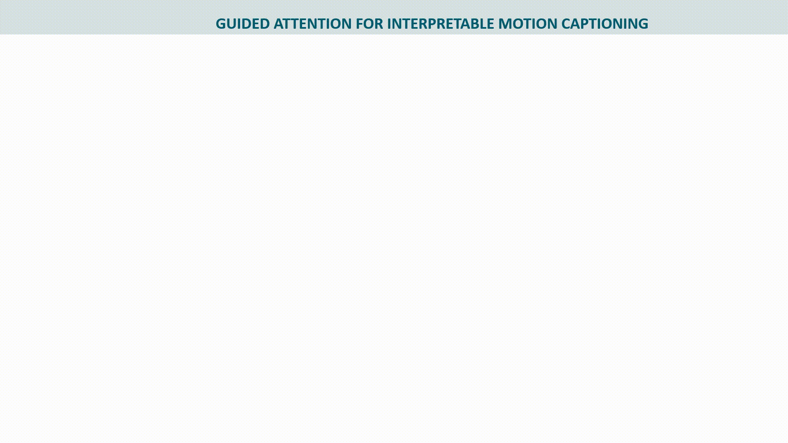
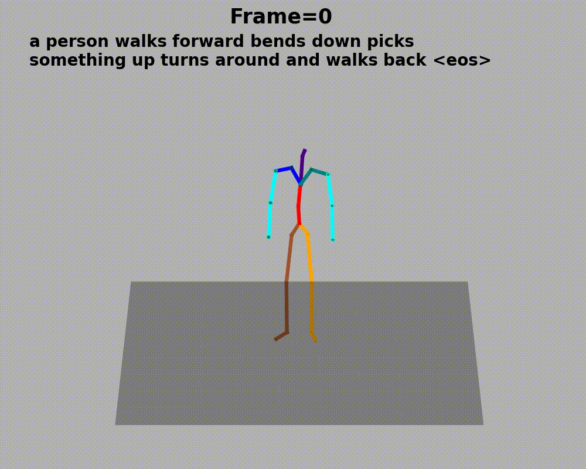
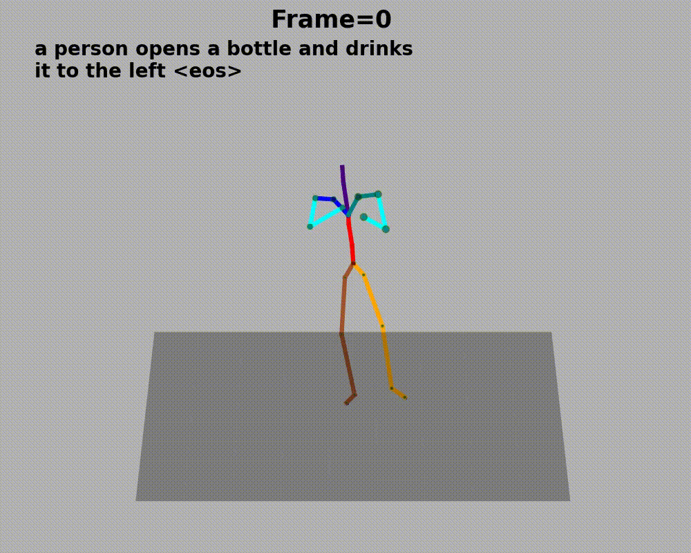
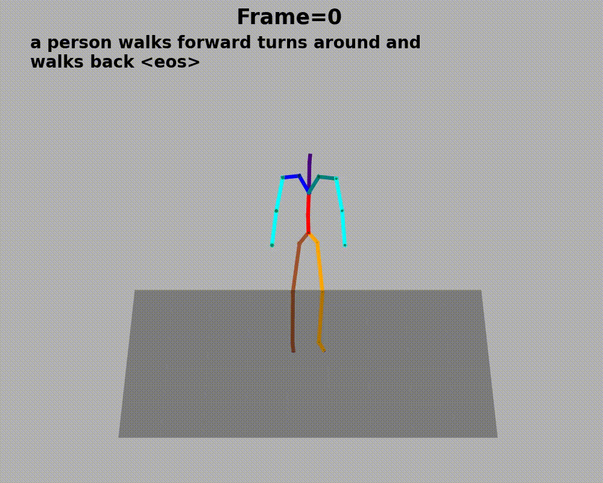

## Description

Official implementation of our paper for interpretable motion to text generation:

<div align="center">

[<span style="font-size: 25px;">Guided Attention for Interpretable Motion Captioning</span>](https://hal.science/hal-04251363v1) 

[](https://arxiv.org/abs/2310.07324v1)
[]()

</div>


<div align="center">

</div>

If you find this code or paper useful in your work, please cite:

```
@article{radouane2023guided,
      title={Guided Attention for Interpretable Motion Captioning}, 
      author={Karim Radouane and Andon Tchechmedjiev and Sylvie Ranwez and Julien Lagarde},
      year={2023},
      eprint={2310.07324},
      archivePrefix={arXiv},
      primaryClass={cs.CV}
}
```


[//]: # (# Architecture design)

[//]: # (<div align="center">)

[//]: # (    <span style="color:darkviolet; font-weight:bold; font-size: 30px">Guided attention for interpretable motion captioning</span>)

[//]: # (</div>)

[//]: # (<div align="center">)

[//]: # ()

[//]: # (</div>)

## Quick start

```
conda env create -f environment.yaml
conda activate wbpy310
python -m spacy download en-core-web-sm
```
You need also to install wandb for hyperparameters tuning: 
``
pip install wandb
``
## Preprocess datasets

For both HumanML3D and KIT-MLD (augmented versions) you can follow the steps here: [project link](https://github.com/rd20karim/M2T-Segmentation?tab=readme-ov-file#preprocess-dataset)

## Models weights

You can download the best models here: [models_weights](https://drive.google.com/drive/folders/1LiirfvZsU5FX1SgNQ1Y6xMeAt52lbVX6?usp=sharing)

| Dataset               | Human-ML3D | Human-ML3D | Human-ML3D | KIT-ML    | KIT-ML     | KIT-ML   |
|-----------------------|------------|------------|------------|-----------|------------|----------|
| Run ID                | ge2gc507   | v6tv9rsx   | hnjlc7r6   | u8qatt2y  |  ton5mfwh  | lupw04om |
| Attention supervision | [0,0]      | [2,3]      | [3,3]      | [0,0]     | [2,3]      | [1,3]    |

Attention supervision parameters respectively refers to spatial and adaptive attention guidance weights.

[//]: # (* Text Preprocessing)

[//]: # ()
[//]: # (This step only required for the first time, you should set the path to the data directory in the file ```kit_h3mld.py``` for KIT and ```h3d_m2t_dataset_.py```.)

[//]: # (Then you can run this scripts for each dataset. This will automatically verify each description and correct possible mistakes only at the word level. )

[//]: # (The corrected sentences will be saved under ```sentences_corrections.csv```.)


## Code functionalities

* All given arguments should correspond to the selected path of model weights in evaluation mode.
* When providing a predefined config file it not necessary to give all the information, it will be inferred.
* For each specified argument bellow all available choices can be displayed by running:

```
python name_script.py --help
```

# Training with hyperparameters tuning

To tune hyperparameters and visualize training progress we use [Wandb](https://wandb.ai/site).

The configuration of hyperparameters defining the search space could directly be set in the file ```./configs/LSTM_{dn}.yaml```
where `dn` is dataset_name (`kit` or `h3D`).

```
python train_wandb.py --config {config_path} --dataset_name {dataset_name}
```


[//]: # ()
[//]: # (As described in the paper [Hal]&#40;https://hal.science/hal-04251363v1&#41; according to ``&#40;l_spat,l_adapt&#41;`` values:)

[//]: # (* No attention supervision: ``&#40;0,0&#41;`` and Spatial or Adaptive:``&#40;l_spat ,l_adapt&#41;``)

* The config path specify the model to train and the hyperparameters to experiment, other values can be added by changing the config file of the chosen model
* SEED is fixed to ensure same model initialization across runs for reproducibility.
* Replace variables ``project_path`` and ``aug_path`` with your absolute data paths. 

# Evaluation

```
python evaluate_m2L.py --config {config_path} --dataset_name {dataset_name}
```
* This script will save various results and model predictions, and compute NLP scores at the batch level. For corpus-level evaluation, use the following:

### NLP scores
After saving the models predictions you can run this script that computes the different NLP metrics and store them in Latex Format.

```
python nlg_evaluation.py
```


# Visualizations


### Attention maps+Pose animation

Generate skeleton animation and attention maps (adaptive+spatio-temporal):

```
python visualizations/poses2concepts.py --path PATH --attention_type ATTENTION_TYPE --n_map NUMBER_ATTENTION_MAP --n_gifs NUMBER_3D_ANIMATIONS --save_results DIRECTORY_SAVE_PLOTS
```

The directory to which save the visualization could be set in the ```.yaml``` file for evaluation or given as argument ```--save_results path```

### Animation examples

* The transparency level of the gold box represents the temporal attention variation for each predicted motion word selected based on adaptive attention. 
* The disque joint represents the level of spatial attention weight for each keypoint.


[//]: # (<div align="center">)

[//]: # ()
[//]: # ()

[//]: # ()

[//]: # ()

[//]: # ()

[//]: # (</div>)


<div align="center">



</div>


## Interpretability analysis

The following steps can be explored for interpret-ability analysis:

* __Adaptive gate density__

You can provide a list of language words you want to display the density curves for in the ```visu_word_attention.py```

* __Motion words histograms__

You can provide a list of motion words you want to display the Histogram plots for in the ```visu_word_attention.py```

* __Spatio-temporal maps__

The following script will generate spatio-temporal attentions maps as well as gates density distributions and motion words histograms,
the figures are saved in the visualizations/model_name/ folder. 

```
python visualizations/visu_word_attention.py --path model_path --dataset_name dataset_name --n_map NUMBER_ATTENTION_MAP --n_gifs NUMBER_3D_ANIMATIONS
```

# Reproduce paper evaluations

You only need to provide the model path preferably to put in  ```./models/model_name``` , then all the config information is inferred from the metadata stored within the model.

###  Write and save model predictions

Run to save the entire predictions on test set for each model for BLEU corpus-level evaluations.

```
python src/evaluate_m2L.py --path {model_path}
```

The config path format: ```f./configs/LSTM_{dataset_name}```


## Beam search
Beam searching can simply be done by adding the argument of the beam size ```--beam-size``` 
```
python src/evaluate_m2L.py --path model_path --beam_size BEAM_SIZE
```

BEAM_SIZE: (=1 equivalent to Greedy search) (>1 for beam searching)  
This script will print the BLEU-4 score for each beam and write beam predictions under the file:

```LSTM_{args.dataset_name}_preds_{args.lambdas}_beam_size_{beam_size}.csv```

## License 

This code is distributed under MIT LICENSE.

